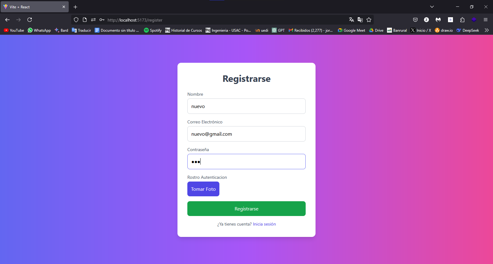
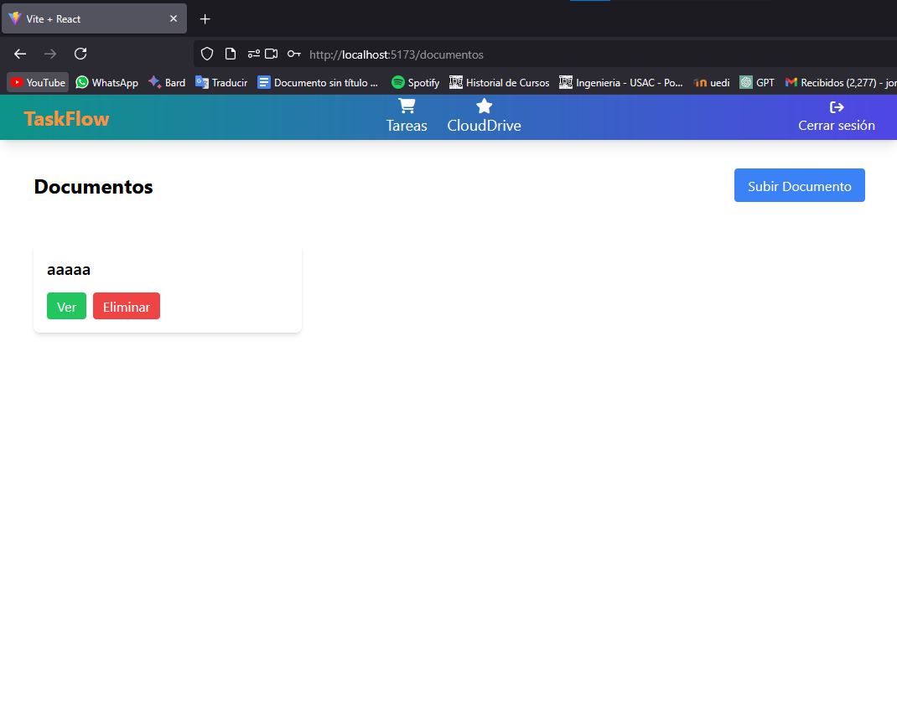
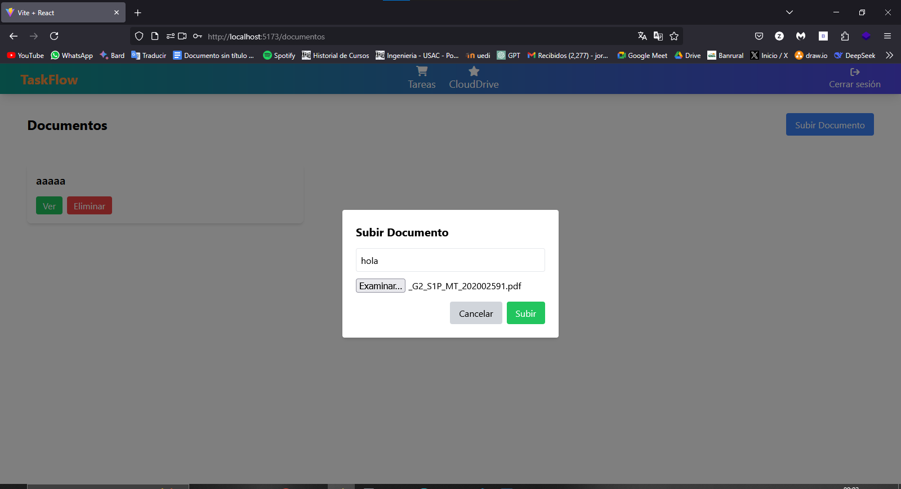
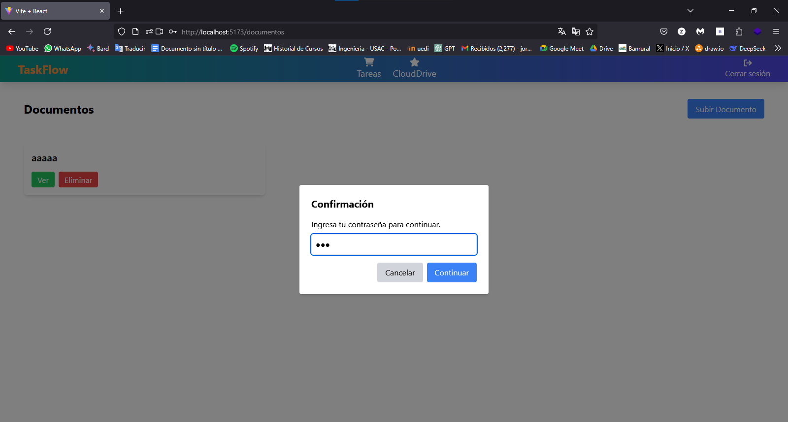
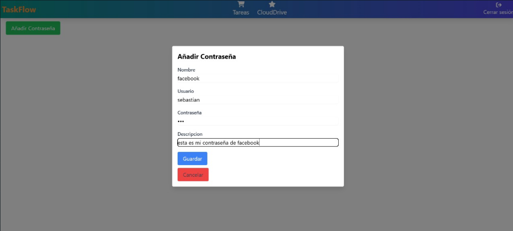
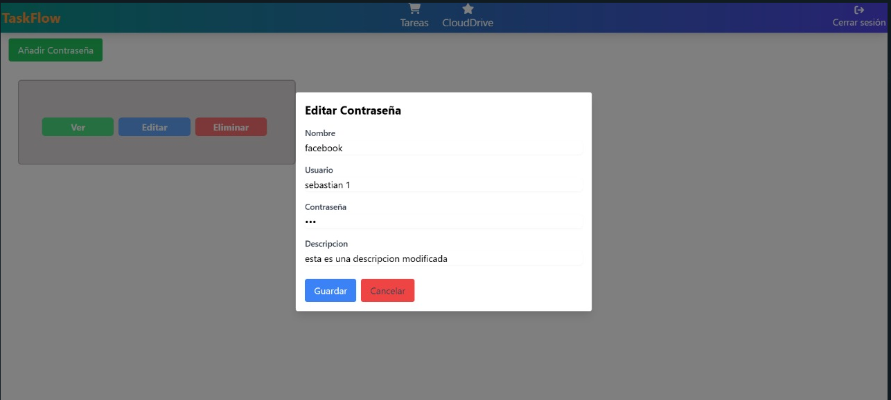
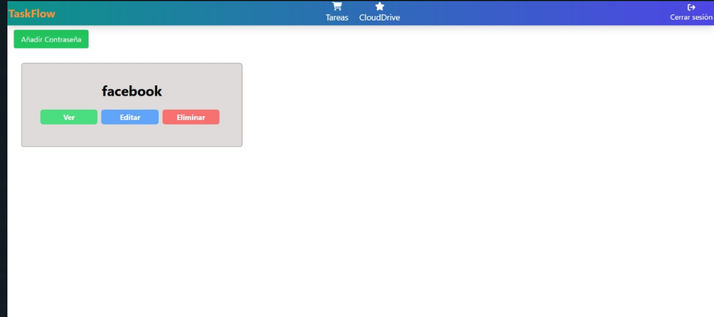

# Manual de Usuario

## 1. Objetivos del manual
- Guiar al usuario en el uso básico de la aplicación Lockify.  
- Mostrar paso a paso cómo registrarse, iniciar sesión y gestionar contraseñas y documentos.  
- Facilitar la familiarización con las funciones principales antes de su uso diario.

---

## 2. Breve descripción de la aplicación
Lockify es una herramienta web diseñada para almacenar de forma segura contraseñas y documentos personales (DPI, pasaporte, títulos, etc.). El acceso está protegido mediante autenticación facial, de modo que sólo el usuario registrado puede ver, añadir, editar o eliminar su información.

## 3. Pasos para utilizar la aplicación

#### Registrarse

#### Login

#### Ver archivos subidos de usuario

#### Subir Archivo

#### Ver File

#### Añadir contraseña

#### Editar Contraseña

#### Ver Contraseñas

