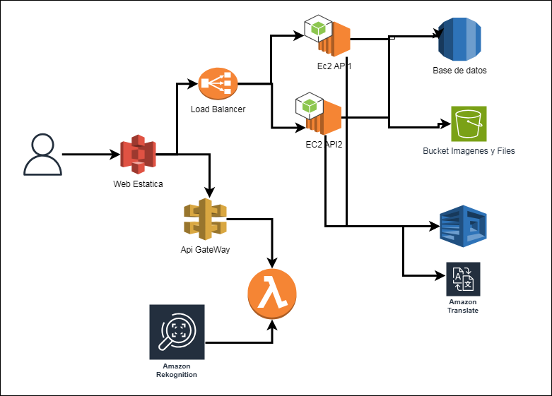

# Manual Técnico

## 1. Objetivos del proyecto
- **General:** Desarrollar una aplicación web que permita a los usuarios guardar de forma segura sus contraseñas y documentos personales, garantizando que solo ellos puedan acceder mediante autenticación facial.  
- **Específicos:**  
  1. Implementar la lógica de alta, baja, consulta y modificación de contraseñas y documentos.  
  2. Asegurar el almacenamiento de archivos y datos mediante cifrado y políticas de acceso.  
  3. Integrar reconocimiento facial para fortalecer la autenticación de usuarios.  
  4. Ofrecer opciones de traducción de etiquetas y lectura en voz alta como funciones de valor añadido.  
  5. Documentar la arquitectura, el presupuesto y la investigación de cada servicio AWS utilizado.

---

## 2. Descripción del proyecto
Lockify es una aplicación web orientada al almacenamiento seguro de contraseñas y documentos personales (DPI, pasaportes, títulos académicos, etc.). El usuario se registra con correo y contraseña, registra su rostro para reconocimiento facial y, a partir de ahí, puede:
- Guardar, editar, eliminar y listar contraseñas.  
- Subir, descargar y eliminar archivos personales.  
- Ver etiquetas traducidas al idioma de su preferencia.  
- Reproducir en voz alta el nombre de una contraseña o documento para mejorar la accesibilidad.

---

## 3. Arquitectura implementada del proyecto

---

## 4. Presupuesto estimado (mensual)

| Servicio                  | Uso estimado               | Costo aproximado (USD) |
|---------------------------|----------------------------|------------------------|
| EC2          | 750 horas                  | $8.50                  |
| Load Balancer             | Tráfico moderado           | $16.00                 |
| RDS        | 750 horas + almacenamiento | $15.00                 |
| S3                        | 10 GB almacenamiento       | $1.00                  |
| API Gateway               | 1 M peticiones             | $3.50                  |
| Lambda                    | 3 M invocaciones           | $1.00                  |
| Rekognition               | 1 000 análisis faciales    | $10.00                 |
| Translate                 | 500 000 caracteres         | $1.00                  |
| Polly                     | 1 000 000 caracteres        | $1.00                  |
| Secrets Manager           | 10 secretos gestionados    | $5.00                  |
| **Total aproximado**      |                            | **≈ $62.00**           |

## 5. Investigación breve de los servicios utilizados

### AWS Lambda  
- **Qué es:** Ejecución de código serverless, paga por invocación y tiempo de ejecución.  
- **Cómo lo usamos:** Todas las operaciones CRUD de contraseñas/documentos y llamadas a servicios avanzados.  
- **Modelo de precios:** $0.20 por 1 M de solicitudes + $0.00001667 por GB‑segundo.

### Amazon API Gateway  
- **Qué es:** Gestión de APIs REST y WebSocket, con integración directa a Lambda. 
- **Modelo de precios:** $3.50 por millón de peticiones.

### Docker  
- **Qué es:** Contenerización de aplicaciones para asegurar consistencia entre entornos.  
- **Cómo lo usamos:** Empaquetamos las funciones Lambda complejas y pruebas locales del backend.

### Amazon EC2  
- **Qué es:** Máquinas virtuales en la nube.  
- **Cómo lo usamos:**  Define endpoints como `/auth`, `/files`, `/credentials`, etc.

### Elastic Load Balancing  
- **Qué es:** Distribuye tráfico entre instancias EC2.  
- **Cómo lo usamos:** Asegura disponibilidad y escalabilidad del frontend.

### Amazon RDS  
- **Qué es:** Base de datos relacional gestionada.  
- **Cómo lo usamos:** Almacenamos usuarios, contraseñas y metadatos de documentos en MySQL/Aurora.

### Amazon S3  
- **Qué es:** Almacenamiento de objetos duradero, escalable y almacenar el sitio web estatico.  
- **Cómo lo usamos:** Guardamos archivos personales subidos, organizados por usuario y fecha.

### Amazon Rekognition  
- **Qué es:** Servicio de visión computacional que incluye detección y comparación facial.  
- **Cómo lo usamos:** Verificamos la identidad del usuario al registrarse y al iniciar sesión.

### Amazon Translate  
- **Qué es:** Servicio de traducción automática neuronal.  
- **Cómo lo usamos:** Traducimos etiquetas de contraseñas/documentos al idioma elegido por el usuario.

### Amazon Polly  
- **Qué es:** Convierte texto en voz natural.  
- **Cómo lo usamos:** Generamos audio con el nombre de documentos o contraseñas para accesibilidad.

### AWS Secrets Manager  
- **Qué es:** Almacenamiento y gestión de secretos cifrados.  
- **Cómo lo usamos:** Guardamos y recuperamos las contraseñas cifradas de los usuarios, centralizando la gestión de claves.

---
